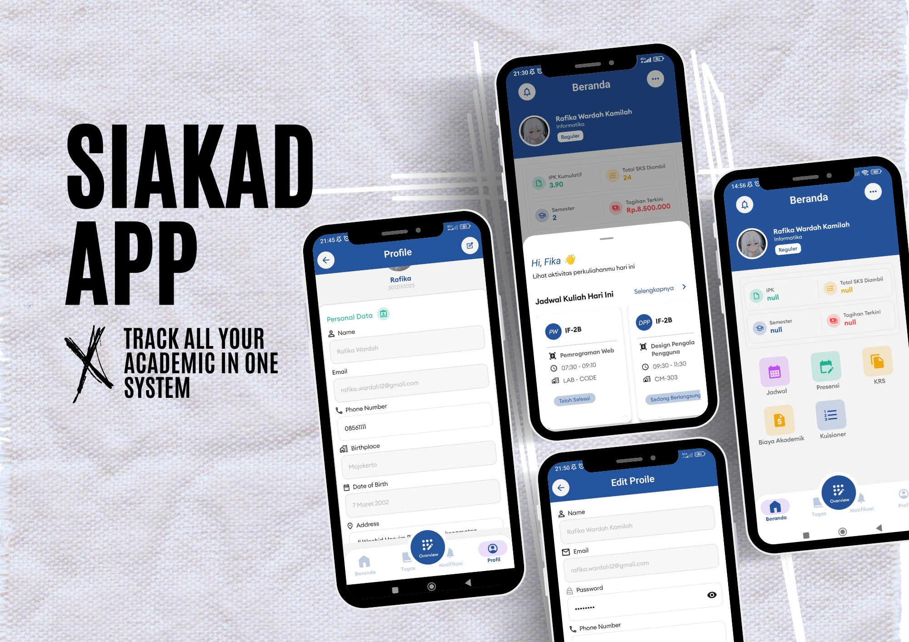

# Coder Mobile
SIAKAD Apps Project: Monitoring student activities in higher education

## Features 
- [x] Applications are can monitoring IPK, SKS, Info status payment in dashboard.
- [x] Submit Assigment
- [x] Correctly implements Android Architecture Components, including ViewModel and LiveData.
- [x] Uses DataStore for saving preferences.

## Preview 

     

## Documentation 
* Design UI/UX : <a href="https://www.figma.com/design/ydhOP4aSWxcVbQUGHsSeAx/Ifest-11---MUC-2023---Bismillah-Menang-Team?node-id=28-242&t=FB4gaTRuLYg6Rcu0-1" target="_blank">Figma Siakad</a>

